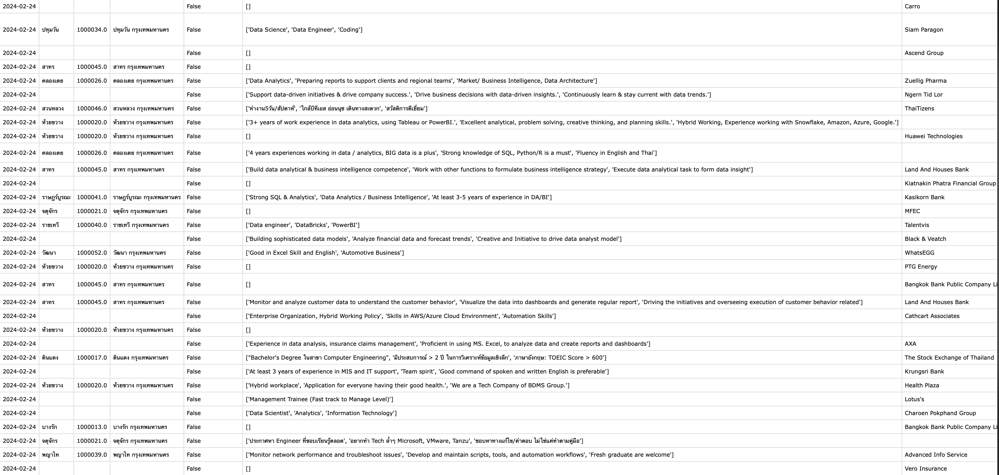

# Data Engineering Job Scraper

Welcome to the Data Engineering Job Scraper repository! This personal project contains a Python script designed to extract information about Data Engineering positions from a specified job posting website. In order to plan my skill path.
The script leverages web scraping techniques through API endpoint to gather job details and present them in a structured format.

## Features
- Scrapes job postings for Data Engineering positions from a job post website.
- Extracts relevant information such as job title, company, location, job description, requirements, and posting date.
- Outputs the scraped data in a CSV file for easy analysis and further processing.

## Output Example

